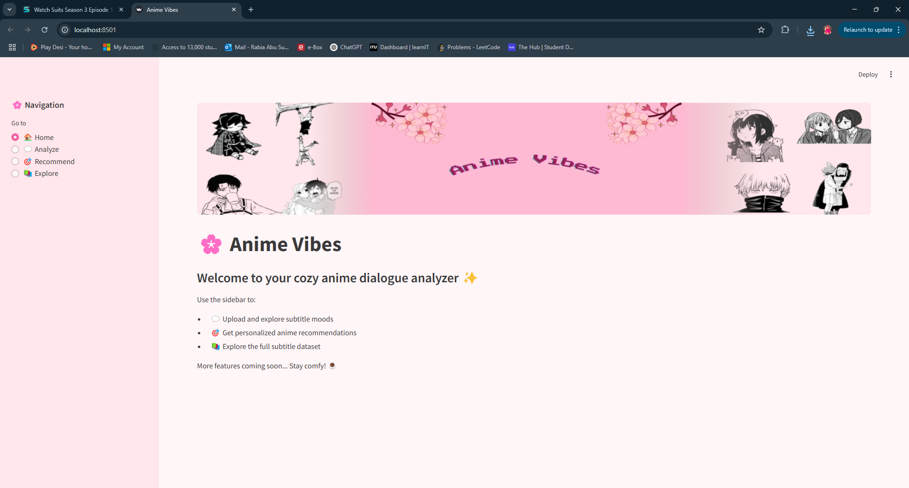
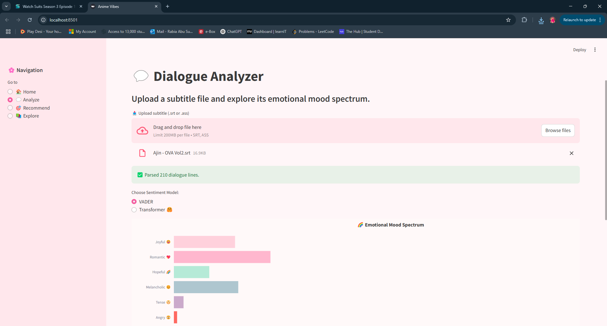
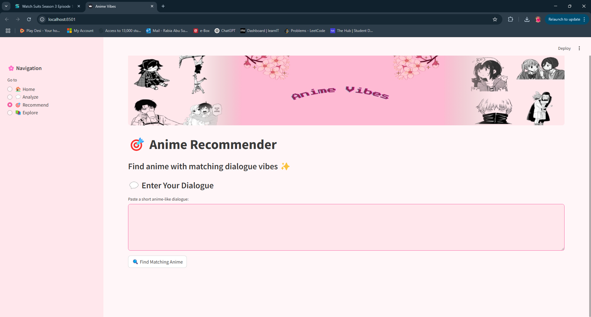

# 🌸 Anime Vibes – Subtitle Mood Explorer & Recommender

Anime Vibes is a cozy Streamlit app that analyzes anime subtitles, detects emotional tones using transformer models, and recommends anime based on dialogue vibes.  
Explore moods, upload your own subtitles, and find hidden anime gems!

---

## 🚀 Features

- Upload `.srt` or `.ass` anime subtitle files  
- Transformer-powered mood classification (Joyful, Melancholic, Romantic, etc.)
- Dynamic vibe exploration with interactive charts  
- Smart anime recommendations based on dialogue semantics  
- Polished pastel UI for a soothing experience

---

## 🛠️ Built With

- 
- 
- 
- 
- 

---

## 🖥️ App Screenshots

| Landing Page | Dialogue Analyzer | Vibe Recommendation |
|:------------:|:------------------:|:-------------------:|
|  |  |  |

---

## ⚡ How to Run Locally

```bash
git clone https://github.com/Rabia-Sufian/anime-vibes-app.git
cd anime-vibes-app
pip install -r requirements.txt
streamlit run app/app.py
